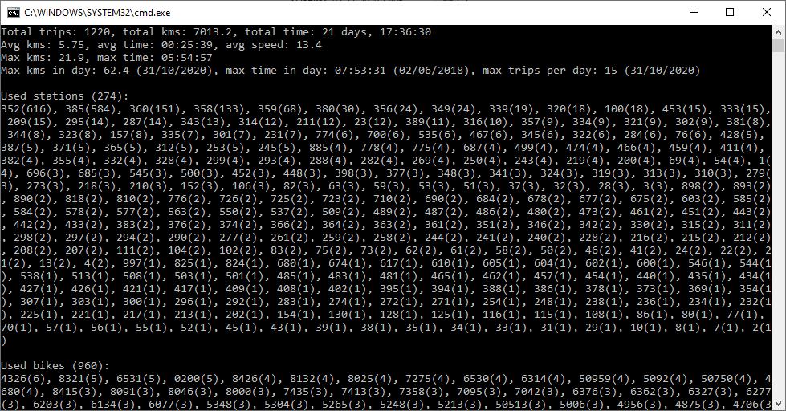

# VelobikeHistory
Python library for https://velobike.ru statistics parsing.
The library scans all pages of account's statistics at https://velobike.ru/account/history.

## Info provided
* Total trips, total kms, total time
* Avg kms, avg time, avg speed
* Max kms, max time, max per day (day)
* Used stations
* Used bikes
* 10 Fastest trips, used bikes
* 10 Longest trips, used bikes
* All trips

## Output example

## Map view
Use additional `--map` flag to generate JSON object for `velomap.html`

# Setup
* Install Python 3
* `pip install BeautifulSoup4`

# Usage
1. Enter login, e.g. 1234567
2. Enter pin, e.g. 1234
3. Enjoy!
